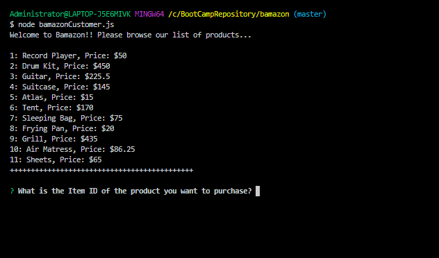
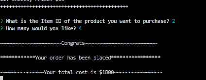
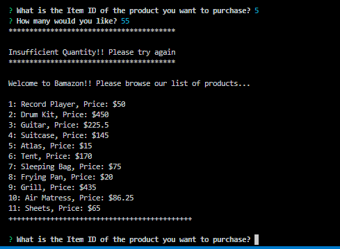

# Bamazon

### This is a front end store that will allow a customer to view available products and purchase.  
### It was created using Node.js

### This app was built using a mySQL database.  Refer to the bamazon.SQL for creating the datbase and tables.

#### To use the app type node bamazonCustomer.js into your terminal

You will be prompted to choose a product from the product list.

Next you will be prompted for the quantity.
If bamazon has enough in stock you will be congratulated and given the total amount of your purchase. 

If for some reason bamazon is out of stock you will be altered and taken back to the product list. 

